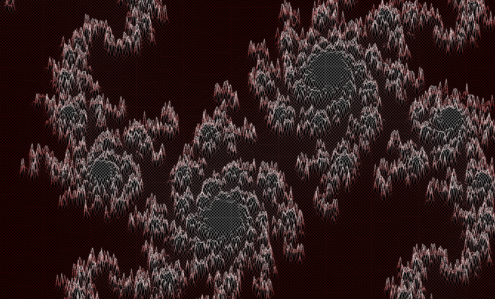
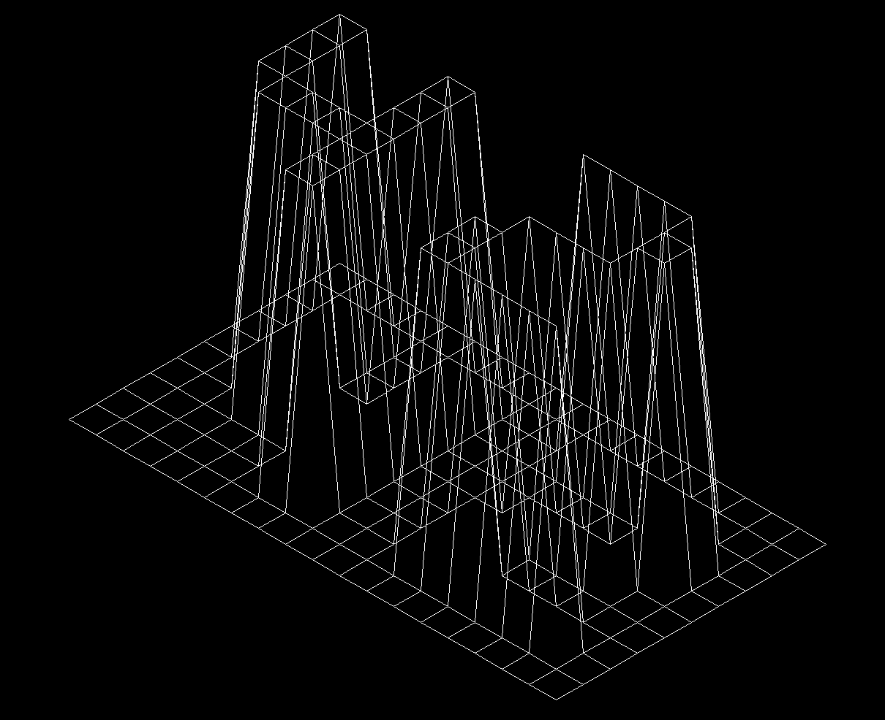

A 3D Wireframe Renderer

# FDF (A 3D Wireframe Renderer)

FDF is a simple isometric 3D wireframe renderer written in C. It takes a map file as input, representing a grid of points in 3D space, and renders it as a wireframe projection on the screen.

## Table of Contents

- [Features](#features)
- [Installation](#installation)
- [Usage](#usage)
- [Map File Format](#map-file-format)
- [Controls](#controls)
- [Conventions](#conventions)
- [Useful links](#useful-links)


## Features


- Renders 3D wireframe models in real-time.
- Simple and intuitive controls.
- Isometric and cavalier projections.

## Installation

1. Clone the repository

   ```bash
   git clone https://github.com/theVeryPulse/fdf.git
   ```

2. Run ```make``` in terminal

4. Run ```make bonus``` to compile fdf of cavalier projection

## Usage
Run the executable ```fdf``` with the map as command line argument
   ```bash
   ./fdf test_maps/42.fdf
   ```


## Map File Format
**42.fdf** from above as an example, its map files looks like this
```
0  0  0  0  0  0  0  0  0  0  0  0  0  0  0  0  0  0  0
0  0  0  0  0  0  0  0  0  0  0  0  0  0  0  0  0  0  0
0  0 10 10  0  0 10 10  0  0  0 10 10 10 10 10  0  0  0
0  0 10 10  0  0 10 10  0  0  0  0  0  0  0 10 10  0  0
0  0 10 10  0  0 10 10  0  0  0  0  0  0  0 10 10  0  0
0  0 10 10 10 10 10 10  0  0  0  0 10 10 10 10  0  0  0
0  0  0 10 10 10 10 10  0  0  0 10 10  0  0  0  0  0  0
0  0  0  0  0  0 10 10  0  0  0 10 10  0  0  0  0  0  0
0  0  0  0  0  0 10 10  0  0  0 10 10 10 10 10 10  0  0
0  0  0  0  0  0  0  0  0  0  0  0  0  0  0  0  0  0  0
0  0  0  0  0  0  0  0  0  0  0  0  0  0  0  0  0  0  0
```

where the row and column represent the coordinates on horizontal plane, and the number value represents the height of that point.

## Controls

| Key(s)    | Action                |
|-----------|-----------------------|
| Arrow Keys| Move the model        |
| I / O Keys| Zoom in / out         |
| W / S Keys| Rotate up / down      |
| A / D Keys| Rotate counter-clockwise / clockwise |
| Q / E Keys| Rotate left / right   |
| Esc Key   | Exit the program      |

Note: Cavalier projection does not support rotation

## Conventions

Points, vectors are represented in column-major vectors. To support translation by matrix, the extra homogenous coordinate is added. Matrices are stored in 4x4 arrays.

[v'] = [Transformation matrix][v]

The world coordinate system has its origin at the centre of the screen, with x-axis pointing rightwards, y-axis pointing upwards, and z-axis pointing outwards the screem.

The camera coordinate system is the same as the world coordinate system.

There is no scaling between world/camera coordinate and screen coordinate, meaning a number in world system corresponds to the same amount of pixels on screen.

Because of this uniformity between screen and raster spaces, the conversion of Normalized Device Coordinates is omitted, and all coordinates are directly converted to raster space (actual pixels).

## Useful Links

**MiniLibX**

[Introduction to the minilibX : a simple X-Window programming API in C | YouTube](https://www.youtube.com/watch?v=bYS93r6U0zg)

[MiniLibX Manual](https://qst0.github.io/ft_libgfx/man_mlx.html)

[MiniLibX Introduction](https://harm-smits.github.io/42docs/libs/minilibx/introduction.html)

**Line Drawing Algorithm**

[Bresenham’s Line Drawing Algorithm | Medium](https://medium.com/geekculture/bresenhams-line-drawing-algorithm-2e0e953901b3)

[Bresenham's line algorithm | Wikipedia](https://en.wikipedia.org/wiki/Bresenham%27s_line_algorithm)

**Render practice (projection, rotation)**

[ Coding Challenge #112: 3D Rendering with Rotation and Projection | YouTube](https://www.youtube.com/watch?v=p4Iz0XJY-Qk)

**Computer Graphics General**

[Scratchapixel](https://www.scratchapixel.com/)
